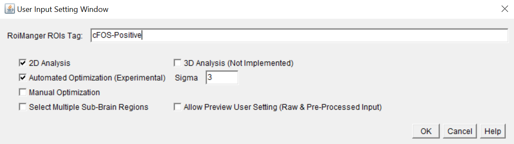

# Quanty-cFOS tool for ImageJ/Fiji

  

  

*where:*	is the single cell intensity
			    is the mean cell intensity computed on the population
			    is the mean cell intensity standard deviation computed on the population

The user can input the range of standard deviations (sigma) to decide the optimal cutoff for cFOS cell count. The cutoff optimization is critical to gain an accurate and robust cells' number estimation. To properly calculate the mean intensity and standard deviation values used for the cutoff the user can specify an arbitrary number of images, compute this values and let the tool process all the other images in a more robust way (see *Batch Analysis* with *Optimization Steps*). To validate how the automated intensity method correlate with human counts, we suggest to manually count cells in few images and run the MATLAB correlation analysis provided with the Quanty-cFOS (`\validation\CorrelationAnalysis.mlx`, see also the ValidationTable.xlsx file as example). The manual count can be performed using your favorite tool or by running the following IJ1 script: https://github.com/cberri/cFOS_ManualAnnotations_ImageJ-Fiji

## Step-by-step Quanty-cFOS Analysis with StarDist 2D

1. Clone or download the Quanty-cFOS repository in your favorite folder:

   `git clone https://github.com/cberri/Quanty-cFOS.git`

2. Drag and drop on the ImageJ/Fiji main window the *Quanty-cFOS.ijm* file. You can also copy the file in the ImageJ/Fiji plugin directory and run the tool using the ImageJ/Fiji GUI (e.g.: `C:\Users\XXX\XXX\XXX\fiji-win64\Fiji.app\plugins`). Please, restart ImageJ/Fiji after this operation

3. The ImageJ/Fiji *Macro Interpreter* window opens

4. Press *Run*

   **NB:** If all the required plugins are properly installed you are ready to use the Quanty-cFOS tool, otherwise you will get instructions in the Log window about what is missing and it needs to be installed. Old version of ImageJ/Fiji can output different error messages. If this is the case, please update ImageJ/Fiji to the latest version or download and install the latest release 

5. The Quanty-cFOS *Main Setting Window* pops up and the user can decide the detection settings. Please check the *Help* to get familiar with the different options. A starting setting to run Quanty-cFOS can be:

   - Uncheck *Use Pre-Processed Image* and check *Run StarDist 2D*

   - In case of large images increase the *StarDist Tails Number*

   - *Batch Analysis* and *Optimization Steps* allow to decide how many images will interactively pop up to the user and in case of *cFOS Automated Optimization* (see below), the number of images used to compute the intensity threshold cutoff for cFOS positive and negative cells. A recommendation for starting is to leave the box unchecked and proceed to the next step by clicking on the *OK* button

  

6. The *Input Dialog Box* pops up and the user can specify the input directory with the raw images to process. The input raw images need to have one channel as MIP or z-stacks. In case of a z-stack, the Quanty-cFOS computes the MIP and start the 2D cell segmentation. To test the Quanty-cFOS you can use the sample images provided together with the tool (`\samples`). 
6. The *User Input Setting Window* pops up. Please check the *Help* to get familiar with the different options. *Tip*: starting with the default setting can give already decent counts

  

8. Press *OK*, the first image will be processed and the *User Input Setting Window* pops up again, every time a new image is processed. To automate further the counting and do not display the *User Input Setting* dialog box for each image the user can check in the *Main Setting Windows* the *Batch Analysis* and set the *Optimization Steps* to the number of images contained in the input raw directory (*e.g.:* 10 Images = 10 Optimization Steps)
9. The Quanty-cFOS output is a folder with sub-folders for each raw image processed. Each sub-folder has the same name of the input image and contains:

   - A *csv* file with the Center of Mass of each detected cell (X, Y, ID, State)
   - A labeled image that displays in yellow the cFOS true positive cells (ID 255) and in purple the cFOS false positive cells (ID 50)
   - The roiManager ROIs with cFOS true positive cells highlighted (see User Input Setting *RoiManager ROIs Tag* function in the Help)
   - By selecting the *Batch Analysis* an additional folder named *LabeledImages* is created. This folder contains all the segmented cells as labeled images for cFOS positive (pixel value 255) and negative (pixel value 50). The idea is to help the user with the next step of the analysis by collecting all the outputs in one single directory 

10. The summary counts are saved in the main directory in the *SummaryMeasurements.cs*v file (tab separator) and the *Log.txt* file contains the user settings used for the analysis. The Log file can be used to document your analysis steps and for instance added in your favorite electronic lab-book 

## Step-by-step Quanty-cFOS Analysis with ilastik Pixel Classification Workflow

1. Open ilastik and create an ilastik pixel classification project. Read the ilastik documentation to learn more https://www.ilastik.org/documentation/pixelclassification/pixelclassification
2. In the ilastik *Export Settings* choose as source *Probabilities*. Click on *Choose Export Image Settings..*. and follow the ilastik documentation to export the probability map of the foreground class (label). It is recommended to convert the data to the same bit depth of the raw images (typically unsigned 8 bits) and check the box *Renormalize [min,max] from*. The input file format for the ilastik probability map images in Quanty-cFOS is tiff. The ilastik output file format can be specified in the *Output File Info* menu. If you choose *HDF5* (strongly recommended for large images) the images can be converted in tiff using the ilastik ImageJ/Fiji plugin (Import HDF5 and save as multipage tiff). More information can be also found here: https://www.ilastik.org/documentation/fiji_export/plugin
3. Open ImageJ/Fiji and run the *Quanty-cFOS.ijm* tool
4. The Quanty-cFOS *Main Setting Window* pops up and the user can decide the detection method. The ilastik option is the default (*Use Pre-Processed Image*). We have tested ilastik pixel classification but any preprocessing or enhancing method should be suitable
5. Click *Run*
6. The *User Input Setting Window* pops up, the user can choose the raw images input directory and click *OK*. By choosing the ilastik detection method a second dialog box pop up and the user can specify the ilastik probability map input directory. Cell segmentation is performed by thresholding the ilastik probability map or any preprocessed input image. User can decide which intensity threshold method to apply and the cell size filter by checking *Allow Preview User Setting* in the *User Input Setting* dialog box. It is very important that the raw and the probability map images have a similar file name and the number of files must be the same in the two input directories. 
7. The process continues as described for Quanty-cFOS with StarDist

## Quanty-cFOS: *cFOS Manual Optimization*

A crucial step in cFOS cell counting is the intensity threshold value used to decide the cutoff above which a cell is considered positive, in particular, if the images are very different from each other. To help users in testing different thresholds and optimize their cells count in a semiautomated unbiased way, the cFOS Manual Optimization function was implemented. By selecting this functionality, the user can get a preview of each image during the analysis and manually choose different intensity threshold values for cFOS positive cell counting. The cFOS Manual Optimization default intensity value displayed to the user is computed by the cFOS Automated Optimization function to help the user in deciding the more appropriated intensity threshold value. Moreover, different size filters based on cell area can be applied to remove small detected particles in the images. The number of images previewed is specified using the *Batch Analysis* option together with the *Optimization Steps*. Indeed, only these images are used for testing different thresholds and the average intensity value of these thresholds is applied on all the following images located in the input raw directory

## Quanty-cFOS: Cell Batch Count without *cFOS Optimization*

All cell counts are possible and can be achieved by unchecking the *cFOS Automated Optimization* and the *cFOS Manual Optimization*. In this way all the cells in the image are counted without an intensity threshold optimization. Only a size cutoff filter (based on cell area) is applied using 3 folds below and above the mean area of cells in the image. This option is supported only with *Batch Analysis* option and it doesn't use any *Optimization Steps* (process all the images in the input directory one-by-one)

### <u>Additional features</u>

Select *Multiple Sub-Brain Region* has been added to allow users to select specific regions of interest in the input images. The user need to run the Quanty-cFOS tool without *batch mode* option and choose as many ROIs as needed to be analyzed. This option works for both segmentation methods, StarDist and ilastik pixel classification

Select *Allow Preview User Setting* to preview the intensity threshold and area cutoff used for the ilastik probability map segmentation (simple method). User can change the intensity threshold method and the cell size filter (area) to best process the images. Currently we support simple thresholding methods to segment cell in the ilastik probability map but we are happy to change the segmentation strategy if someone is interested. Please get in touch with us

