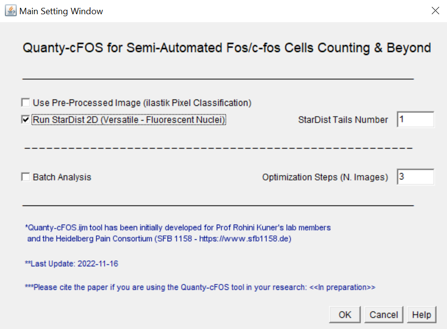

# Quanty-cFOS.ijm: An ImageJ/Fiji tool to count Fos/*c-fos* Positive Neurons

  
  
  

*where:*	is the single cell intensity
			    is the mean cell intensity computed on the population
			    is the mean cell intensity standard deviation computed on the population

The user can input the range of standard deviations (*sigma*) to decide the optimal cutoff for Fos/*c-fos* cells count. The cutoff optimization is critical to gain an accurate and robust cells' number estimation. To properly calculate the mean intensity and standard deviation values used for the cutoff the user can specify an arbitrary number of images, compute these values and let the tool process all the other images in a more robust way (see *Batch Analysis* with *Optimization Steps*). To validate how the automated intensity method correlates with human counts, we suggest to manually count cells in few images and run the MATLAB correlation analysis provided with the Quanty-cFOS (`\validation\CorrelationAnalysis.mlx`, see also the ValidationTable.xlsx file as an example). The manual counts can be performed using your favorite tool or by running the following IJ1 script developped to [validate this method](https://github.com/cberri/cFOS_ManualAnnotations_ImageJ-Fiji)

## Step-by-step: Quanty-cFOS Analysis with *StarDist*

1. Clone or download the Quanty-cFOS repository in your favorite folder:

   `cd PATH_TO_YOUR_FAVORITE_FOLDER`

   `git clone https://github.com/cberri/Quanty-cFOS.git`

2. Drag and drop on the ImageJ/Fiji main window the *Quanty-cFOS.ijm* file. You can also copy the file in the ImageJ/Fiji plugin directory and run the tool using the ImageJ/Fiji GUI (e.g.: `C:\Users\XXX\XXX\XXX\fiji-win64\Fiji.app\plugins`). Please, restart ImageJ/Fiji after this operation

3. Start the Qunaty-cFOS tool by pressing *Run* or by choosing the tool from the ImageJ/Fiji plugin menu

   **NB:** If all the required plugins are properly installed you are ready to use the Quanty-cFOS tool, otherwise you will get instructions in the Log window about what is missing and needs to be installed. Old version of ImageJ/Fiji can output different error messages. If this is the case, please update ImageJ/Fiji to the latest version or download and install the latest release 

4. The Quanty-cFOS *Main Setting Window* pops up and the user can decide the detection method. Please check the *Help* to get familiar with the different options. A starting setting to run Quanty-cFOS can be:

   - Uncheck *Use Pre-Processed Image* and check *Run StarDist 2D*

   - In case of large images increase the *StarDist Tails Number*

   - *Batch Analysis* and *Optimization Steps* allow to decide how many images will interactively pop up to the user and in case of *Automated Optimization* (see below), the number of images used to compute the intensity threshold cutoff for Fos/*c-fos* positive and negative cells. A recommendation for starting is to leave the box unchecked and proceed to the next step by clicking the *OK* button

  

6. The *Input Dialog Box* pops up and the user can specify the input directory with the raw images to process. The input raw images need to have one channel as MIP or z-stacks. In case of a z-stack, the Quanty-cFOS computes the MIP and starts the 2D cell segmentation. To get familiar with the Quanty-cFOS tool you can use the sample images provided together with the tool (`\samples`)
7. The *User Input Setting Window* pops up. Please check the *Help* to get familiar with the different options. *Tip*: starting with the default setting can give already decent counts

  

8. Press *OK*, the first image will be processed and the *User Input Setting Window* pops up again, every time a new image is processed. To automate further the counting and do not display the *User Input Setting* dialog box for each image the user can choose in the *Main Setting Windows* the *Batch Analysis* and set the *Optimization Steps* to the number of images needed to compute the intensity cutoff (*e.g.:* 10 *Optimization Steps* =  first 10 Images are used to compute the intensity cutoff)
9. The Quanty-cFOS output is a folder with sub-folders for each raw image processed. Each sub-folder has the same name of the input image and contains:

   - A *csv* file with the Center of Mass of each detected cell (X, Y, ID, State)
   - A labeled image that displays in yellow the Fos/*c-fos* positive cells (ID 255) and in purple the cells counted as negative (ID 50)
   - The RoiManager ROIs with Fos/*c-fos* positive and negative cells highlighted (see User Input Setting RoiManager ROIs Tag function in the Help)
   - By selecting the *Batch Analysis* an additional folder named *LabeledImages* is created. This folder contains all the segmented cells as labeled images for Fos/*c-fos* positive (pixel value 255) and negative (pixel value 50). The idea is to help the user with the next steps of the analysis by collecting all the outputs in one single directory

10. The summary counts are saved in the main directory in the *SummaryMeasurements.cs*v file (tab separator) and the *Log.txt* file contains the user settings used for the analysis. The Log file can be used to document your analysis steps and for instance added in your favorite electronic lab-book 

## Step-by-step: Quanty-cFOS Analysis with *ilastik Pixel Classification*

1. Open ilastik and create an ilastik pixel classification project. Read the [ilastik documentation](https://www.ilastik.org/documentation/pixelclassification/pixelclassification) to learn more
2. In the ilastik *Export Settings* choose as a source *Probabilities*. Click on *Choose Export Image Settings..*. and follow the ilastik documentation to export the probability map of the foreground class (label). Convert the data to unsigned 8 bits and check the box *Renormalize [min,max] from*. The input file format for the ilastik probability map images in Quanty-cFOS is tiff. The ilastik output file format can be specified in the *Output File Info* menu. If you choose *HDF5* (strongly recommended for large images) the images can be converted in tiff using the ilastik ImageJ/Fiji plugin (Import HDF5 and save as multipage tiff). More information can be also found [here](https://www.ilastik.org/documentation/fiji_export/plugin)
3. Open ImageJ/Fiji and run the Quanty-cFOS.ijm tool
4. The Quanty-cFOS *Main Setting Window* pops up and the user can decide the detection method. The ilastik option is the default (*Use Pre-Processed Image*). We have tested ilastik pixel classification but any preprocessing or enhancing method should be suitable
5. Click *OK*
6. The *User Input Setting Window* pops up, the user can choose the raw images input directory and click *OK*. By choosing the ilastik detection method a second dialog box pop up and the user can specify the ilastik probability map input directory. Cell segmentation is performed by thresholding the ilastik probability map or any preprocessed input image. User can decide which intensity threshold method to apply and the cell size filter by checking *Allow Preview User Setting* in the *User Input Setting* dialog box. It is very important that the raw and the probability map images have a similar file name and the number of files must be the same in the two input directories. 
7. The process continues as described for Quanty-cFOS with StarDist

## Quanty-cFOS: *Manual Optimization*

A crucial step in Fos/*c-fos* cell counting is the intensity threshold value used to decide the cutoff above which a cell is considered positive, in particular, if the images are very different from each other. To help users in testing different thresholds and optimize their cells count in a semiautomated unbiased way, the *Manual Optimization* function was implemented. By selecting this functionality, the user can get a preview of each image during the analysis and manually choose different intensity threshold values for Fos/*c-fos* positive cell counting. Displayed *Manual Optimization* default intensity value is computed by the *Automated Optimization* function to help the user in deciding the more appropriate intensity threshold value. Moreover, different size filters based on cell area can be applied to remove small detected particles in the images. The number of images previewed is specified using the *Batch Analysis* option together with the *Optimization Steps*. Indeed, only these images are used for testing different thresholds and the average intensity value of these thresholds is applied on all the following images located in the input raw directory

## Quanty-cFOS: Cell Batch Count *Without  Automated or Manual Optimization*

All cell counts are possible and can be achieved by unchecking the *Automated Optimization* and the *Manual Optimization*. In this way all the cells in the image are counted without an intensity threshold optimization. Only a size cutoff filter (based on cell area) is applied using 2 folds below and above the mean area of cells in the image. This option is supported only with *Batch Analysis* option and it doesn't use any *Optimization Steps* (processes all the images in the input directory one-by-one)

### <u>Additional features</u>

Select *Multiple Sub-Brain Region* has been added to allow users to select specific regions of interest in the input images. The user needs to run the Quanty-cFOS *without batch mode* option and choose as many ROIs as needed to be analyzed. This works for both segmentation methods: StarDist and ilastik pixel classification

Select *Allow Preview User Setting* to preview the intensity threshold and area cutoff used for the ilastik probability map segmentation (simple method). User can change the intensity threshold method and the cell size filter (area) to best process the images. 

Currently we support simple thresholding methods to segment cells in the ilastik probability map but we are happy to improve the segmentation strategy if someone is interested. Please get in touch!

## Citation

Please cite the paper if you are using the Quanty-cFOS tool in your research:

In preparation.

## References

Schmidt, U., Weigert, M., Broaddus, C., & Myers, G. (2018). Cell Detection with Star-Convex Polygons. In Medical Image Computing and Computer Assisted Intervention – MICCAI 2018 (pp. 265–273). Springer International Publishing.[ doi:10.1007/978-3-030-00934-2_30](https://doi.org/10.1007/978-3-030-00934-2_30)

*ilastik: interactive machine learning for (bio)image analysis*
Stuart Berg, Dominik Kutra, Thorben Kroeger, Christoph N. Straehle, Bernhard X. Kausler, Carsten Haubold, Martin Schiegg, Janez Ales, Thorsten Beier, Markus Rudy, Kemal Eren, Jaime I Cervantes, Buote Xu, Fynn Beuttenmueller, Adrian Wolny, Chong Zhang, Ullrich Koethe, Fred A. Hamprecht & Anna Kreshuk in: Nature Methods, (2019)
